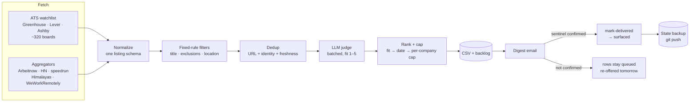

# Job Scout: pipeline design and failure handling

A daily pipeline that pulls job listings from more than 300 company job boards and five aggregators, filters them with fixed rules, scores them with an LLM judge, and emails a ranked digest. It has run unattended every morning since September 2026.

This repo describes **how the pipeline works and how it handles failure**. It does not contain the code. The scraper runs against a private candidate profile and private state, so what's public is the design, the failure catalog, and the reasoning behind each decision.

## The core problem

Scrapers rarely crash. When they break, they keep running and quietly return less. A dead board slug, a rate-limited API, a judge that times out, an email that never sends: each of these turns into a smaller digest with exit code 0, which looks exactly like a slow day in the job market.

One rule shapes almost every decision below:

> **A quiet day and a broken pipeline must never look the same.**

## Architecture

| Stage | What it does | Why it's built this way |
|---|---|---|
| **Fetch** | Polls ATS APIs per company, plus aggregator APIs, RSS, and the monthly HN thread | Every company on the watchlist was picked on purpose, and it's where the best matches come from. Aggregators are noisy and get treated as lower-prior sources. |
| **Normalize** | Maps every source to one schema: `{source, track, company, title, location, url, posted_date, date_basis, description}` | Each source reports remote status, dates, and location differently. Everything after this stage reads one shape. |
| **Filter** | Regex rules on title keywords, title exclusions (seniority, go-to-market roles), industry exclusions, and location eligibility | Rules that never change are applied in code, not by the LLM. This is cheaper, you get the same answer every time, and you can check it. |
| **Dedup** | Three layers: URLs seen, `company\|title` identities with their last posting date, and a set of roles already shown | See [dedup and state](docs/dedup-and-state.md). Getting this wrong made the pipeline blind for days. |
| **Judge** | `claude -p` headless, batches of 12, scores fit from 1 to 5 against the profile | See [LLM judge](docs/llm-judge.md). If a batch fails, its rows go through tagged instead of being dropped. |
| **Rank** | Sorts by fit, then posting date, then company. Max 3 per company, top 30 per day | Fit always beats date. Rows held back by a cap go to the backlog and aren't thrown away. |
| **Deliver** | An LLM sends the digest email, and must print a fixed confirmation line (a sentinel) to prove it sent | A clean exit isn't proof the mail went out. Only confirmed delivery marks a role as shown. |
| **Back up** | Commits and pushes the two JSON state files | Losing state means re-sending every role already reviewed. |

## How it handles failure

| Failure | Detection | Handling |
|---|---|---|
| Laptop wakes before wifi is up | Connectivity probe against a real ATS host | Retries for about 5 minutes, then aborts loudly. A ConnectionError on every board is never reported as "0 new roles". |
| A company's board slug dies | Per-board `!` warning line, plus a `--check-watchlist` verifier | Skips that board and keeps going. The warning lands in the digest and in a running count of repeat failures. |
| Aggregator rate-limits mid-scan | Exception during paging | Keeps the partial results and logs `TRUNCATED at offset N`, so a cut-short scan never looks complete. |
| Network outage hits ~100 boards at once | Many network errors on the same host | Logged as one `network outage: <host>` entry so the real repeat failures aren't buried. |
| LLM judge fails or skips rows | Subprocess failure, unparseable JSON, missing indices | Rows pass through as `[UNJUDGED]`. The run exits **2 (DEGRADED)** and the digest says so at the top. |
| Every source fails | Nothing fetched | Exits **1**, and the email becomes a failure report instead of a digest. |
| Digest email doesn't send | No `DIGEST_SENT_OK` sentinel in the sender's output | Roles stay queued and are re-offered tomorrow. A desktop notification fires. |
| State backup fails | git commit or push fails | Critical notification. The state is one disk failure from gone. |
| A source changes its API or meaning | Contract tests, live-data audits | See [source drift](docs/source-drift.md). |

Full catalog with incident notes: **[docs/failure-modes.md](docs/failure-modes.md)**.

### Exit codes

| Code | Meaning | Treated as |
|---|---|---|
| `0` | Clean run (may legitimately find nothing) | Success |
| `1` | Hard failure, nothing fetched | Failure report email + critical alert |
| `2` | **Degraded:** results exist, but some judge batches failed | Digest, with the degradation stated first |

Source warnings (one board dead, one feed cut short) don't change the exit code, since the run still produced valid results. They show up through their own channel: a `SOURCE WARNINGS` block in the digest, a notification that fires even when no digest is sent, and an append-only tally of repeat failures.

## Docs

- **[Failure modes](docs/failure-modes.md):** every failure seen in production, how it was caught, and the fix
- **[Source drift](docs/source-drift.md):** how job boards change, mislead, and break, and the evidence used to accept or reject a source
- **[Dedup and state](docs/dedup-and-state.md):** the state model, freshness-based reopening, and why only confirmed delivery marks a role as shown
- **[LLM judge](docs/llm-judge.md):** batching, untrusted input, degraded mode
- **[Testing](docs/testing.md):** testing a pipeline that fails silently, and three ways those tests lied

## Stack

Python (`requests`, stdlib XML/JSON) · Bash runner · systemd user timer (`Persistent=true`) · Claude CLI headless for the judge and email delivery · git for state backup.
